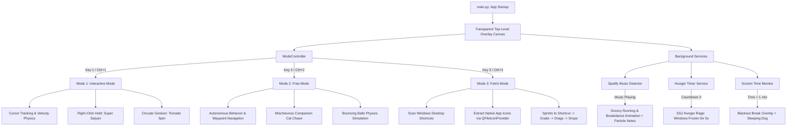
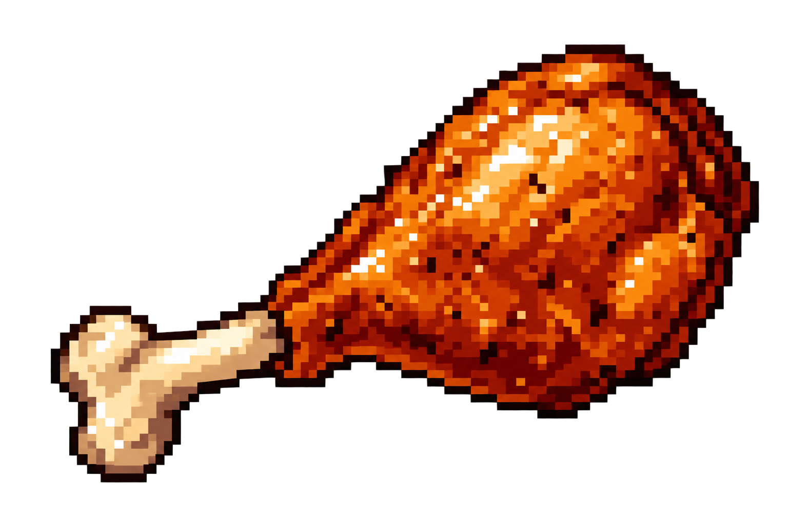
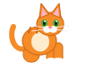

# Chavalam Patti 🐕🎯

A delightfully chaotic, semi-sentient desktop virtual pet that wanders across your Windows screen, demands chicken drumsticks under threat of freezing your entire desktop with Super Saiyan Kamehameha rage, spins into destructive tornadoes, rolls in filthy mud, grooves whenever Spotify plays music, forces you into health breaks by blacking out your screen, and runs over to your desktop shortcuts to physically drag and relocate them across your monitor.

---

## Basic Details
### Team Name: `SHORT CIRCUIT`

### Team Members
- **Team Lead:** Jose T Olickal - Muthoot Institute of Technology and Science
- **Member 2:** Irwin J Thekkekara - Muthoot Institute of Technology and Science

---

### Project Description
**Chavalam Patti** is a feature-rich, interactive desktop companion engineered with PySide6 and Windows Win32 APIs. It runs seamlessly as a frameless, transparent overlay on top of all active Windows applications, featuring 3 selectable operating modes, dynamic physics-based toys, Spotify audio integration, gesture recognition, and an unrelenting hunger countdown.

---

### The Problem (that doesn't exist)
Modern operating systems and desktops are far too organized, silent, and productive. 
- Desktop icons sit quietly in neat, predictable grid columns where you left them.
- Spotify playlists stream in the background without an animated canine doing 360° breakdance spins across your code editor.
- Programmers work for hours without an icy freeze-screen overlay holding their open windows hostage because an autonomous pixel-dog missed lunch by 5 seconds.
- Desktops completely lack muddy paw prints, roaming companion cats, and tornado air-lifts.

---

### The Solution (that nobody asked for)
We built **Chavalam Patti**—the ultimate desktop disrupter that turns mundane screen time into an unpredictable adventure.
- **3 Dynamic Operating Modes**: Switch between manual cursor tracking (**Interactive Mode**), autonomous roaming with cat chasing and bouncy balls (**Free Mode**), and physical desktop icon dragging (**Fetch Mode**).
- **Shortcut Stealing Fetch System**: Press a key in Fetch Mode, and the dog will scan your real Windows desktop, pick a random shortcut (like Discord, Steam, or Valorant), run over to it, clamp it in its mouth, and drag it to a new random location.
- **Super Saiyan Hunger Rage**: Forget to feed the dog a chicken drumstick before the timer expires, and it ascends into Super Saiyan with genuine anime SFX, violently rattling the screen and freezing Windows desktop interactions under an icy frost for 5 seconds.
- **Spotify Music Groovy Dance**: Automatically hooks into Windows audio/process streams. Whenever Spotify plays music, the dog ignores hunger and screen breaks to sprint and dance across your display with floating musical note particles.
- **Mud Mode & Shower Cleaning**: Let the dog roll in mud to leave muddy footprints everywhere, then trigger an animated 10-frame shower curtain sequence to wash him squeaky clean.
- **Enforced Screen Time Breaks**: After every 1 minute of screen time, the dog guides you to take a break by walking to the center of the screen, curling up to sleep, and dimming the entire screen to black.

---

## Technical Details

### Technologies/Components Used

#### For Software:
- **Languages Used:** Python 3.10+
- **GUI Framework:** PySide6 / Qt6 (`QLabel`, `QWidget`, `QPainter`, `QTransform`, `QTimer`, `QFileIconProvider`, `QSoundEffect`)
- **System Integration & APIs:**
  - `ctypes` & `wintypes` (Win32 API: `User32.dll`, `Gdi32.dll`, `Dwmapi.dll` for transparent pass-through, hardware bounds, and display metrics)
  - `pynput` (Global keyboard hotkeys and non-blocking mouse hook listeners)
  - Windows COM & Shell APIs (Desktop shortcut scanning and `.lnk` extraction)
- **Audio & Multimedia:**
  - `PySide6.QtMultimedia` with FFmpeg backend
  - `winsound` native fallback audio pipeline
  - Low-latency WAV sound effects (barking, running, Super Saiyan aura, Kamehameha, tornado whoosh)
- **Tools & Environment:**
  - VS Code / Antigravity IDE
  - Git & GitHub
  - Python Virtual Environment (`.venv`)

#### For Hardware:
- Standard Windows 10 / 11 PC or Laptop
- Mouse / Trackpad (supporting circular gesture drawing and right-click hold)
- Stereo audio speakers or headphones for authentic dog barking and SSJ SFX

---

## Implementation

### Installation

1. **Clone the Repository:**
   ```bash
   git clone https://github.com/tekku11/Virtual-Dog.git
   cd Virtual-Dog
   ```

2. **Set Up a Virtual Environment (Recommended):**
   ```bash
   python -m venv .venv
   # Windows PowerShell:
   .venv\Scripts\Activate.ps1
   # Or Windows Command Prompt:
   .venv\Scripts\activate.bat
   ```

3. **Install Dependencies:**
   ```bash
   pip install PySide6 pynput
   ```

### Run

```bash
python main.py
```

---

## Key Operating Modes & Controls

| Mode / Feature | Trigger Keys | Description |
| :--- | :--- | :--- |
| **Interactive Mode** | `1` or `Ctrl+1` | Dog follows cursor (Walk, Run, Slow, Sit, Sleep). |
| **Free Mode** | `2` or `Ctrl+2` | Autonomous roaming. Clean dog is calm; Muddy dog zooms wildly. |
| **Fetch Mode** | `3` or `Ctrl+3` | Dog stands ready to fetch desktop shortcuts. |
| **Fetch Shortcut** | `Space` / `3` / `G` / Click Dog | Dog runs to a real desktop shortcut, picks it up, drags it across the screen, and drops it. |
| **Feed Dog** | `F` | Spawns a chicken drumstick, resets hunger timer, and triggers 10-frame eating animation. |
| **Super Saiyan** | Hold Right Mouse on Dog | Dog charges up, grows in size, screen shakes violently, and anime audio blasts. |
| **Tornado Spin** | Draw Circle with Mouse | Dog vanishes into a high-speed spinning tornado vortex for 5 seconds. |
| **Mud Mode** | `M` | Dog rolls in a mud puddle and splatters muddy footprints as he walks/runs. |
| **Shower Cleaning** | `C` | Animated shower curtain appears with washing sounds to clean the dog. |
| **Chase Cat** | `Ctrl+K` | Spawns a fast companion cat in Free Mode for the dog to chase. |
| **Play Balls** | `Ctrl+B` | Spawns bouncy tennis and red balls with gravity and wall-bounce physics. |
| **Spotify Dance** | Automatic or `D` / `Ctrl+D` | Dog dances and runs across screen with musical notes when music plays. |
| **Mode Context Menu** | Click HUD / Right-Click Dog | Interactive popup menu to switch modes, fetch, dance, or feed. |
| **Emergency Quit** | `Ctrl+Shift+Q` | Instantly terminates the virtual dog and all background overlays. |

---

## Project Documentation

### Architecture Workflow


### Screenshots

# Screenshots

*Chavalam Patti desktop companion in action.*


*Interactive feeding mechanism featuring drumstick physics and mud transitions.*


*Companion cat and bouncy ball toys summoned during autonomous Free Mode.*

---

## Project Demo

### Video
- **Demo Video:** *[Insert Demo Video Link Here]*
- *Demonstrates mode switching, shortcut fetching, Spotify music dancing, hunger freeze rage, mud rolling, and shower cleaning.*

### Additional Demos
- Standalone feeding module: `python feeding_feature.py`
- Test suites:
  - Operating Modes: `python scratch/test_operating_modes.py`
  - Spotify Dance: `python scratch/test_spotify_dance.py`
  - Fetch Shortcut: `python scratch/test_fetch_mode.py`
  - Screen Time Break: `python scratch/test_screen_break.py`

---

## Team Contributions
- **Jose T Olickal**:
  - Engineered the core PySide6 animation canvas, transparent window management, and frame tick physics.
  - Implemented Win32 mouse/keyboard hooks, gesture recognition (Tornado circle detection, SSJ hold).
  - Built the Windows shortcut scanner, native icon badge extractor, and physical drag-and-drop Fetch Mode.
  - Created the Spotify music detection pipeline and dynamic particle-note dance renderer.

- **Irwin J Thekkekara**:
  - Designed the Free Mode autonomous state machine, weighting distributions, and boundary reflection algorithms.
  - Developed the Cat companion sprite system and bouncing toy ball physics engine.
  - Implemented the feeding countdown system, drumstick trajectory, and icy Super Saiyan hunger freeze overlay.
  - Built the 10-frame shower cleaning sequence, mud footprint persistence, and 1-minute screen break blackout system.

---

Made with ❤️ at TinkerHub Useless Projects


